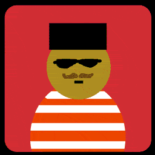
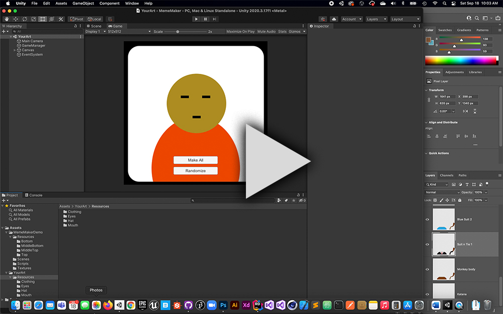

# MemeMaker
A Unity project to generate unique 2D memes based on a background and 4 or more accesory zones. The script loads however many images are in each sub-folder of the Resources folder. It then randomly picks either one texture or no texture from each zone. By having 10 items in each of the 4 zones it is possible to generate 10,000 unique memes.

If a background and background palette is specified, each meme gets a random background color based off the palette, otherwise the background will be the same for all of them. It would be easy to extend that to other items of the base character, like the face or clothing base. Just replicate the code used for the background to whatever other part you wish.

## Instructions

This script creates unique images by reading textures from folders located in the Resource folder. Each folder should be
for a certain zone, i.e hat/hair or clothing.
 1. Drag all of your hair/hat options  into the Top folder
 2. Repeat for every other area
 3. There is no limit to the number of areas, but the m_images and m_paths need to have the same array length
 4. Areas can have different numbers of items, fewer items will appear less often
 5. All images should be the same size and transparent
 6. Hit play and then the Make All button. Images will be written to the hard drive, depending on your system
 7. When using the Unity Editor, the screenshots will written to disk above the Assets folder inside a folder called 'screenshots'

This example scene is set to run at 512px X 512px and expects 512px images to make pixel perfect Memes. This can be change to whatever dimension you want by changing the Preview area and Canvas Scaler component.

When using a background palette, make sure it's import setting is set to Read/write in Unity.

## Photoshop and Unity Importing

Open the MemesLayers.psd example to see how the layers are created and organized. To export all the layers:
 1. Make All the layers visible
 2. Use File>Export>Layers To Files with the export all visible option checked and use the transparent .png format
 3. Export the base layer and background separately
 4. Drag all of your parts into the folders
 5. In Unity, make sure they are imported as Default Textures (not Sprites) and check the Alpha is Transparent option

## Video Walk through

